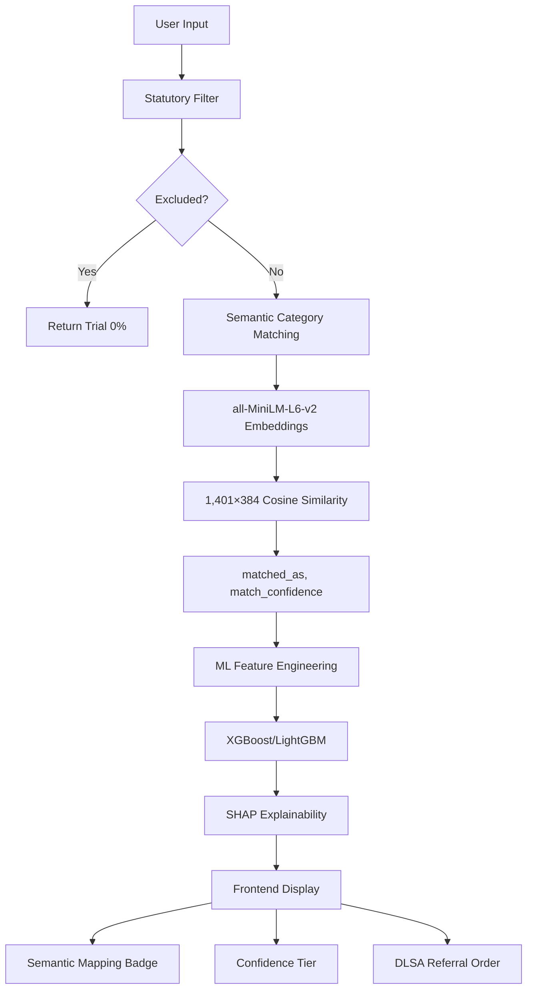

# Nyaya Setu (न्याय सेतु) — District Court ADR Suitability Screening Platform

[](https://fastapi.tiangolo.com)
[](https://reactjs.org)
[](https://xgboost.readthedocs.io)
[](https://www.sbert.net)
[](LICENSE)
[](https://legislative.gov.in)

**Nyaya Setu** is an AI-powered Alternative Dispute Resolution (ADR) Suitability Screening System engineered for India's District Courts and District Legal Services Authorities (DLSAs). It combines **statutory compliance**, **machine learning ranking**, and **semantic case type understanding** to identify disputes suitable for conciliation, mediation, or Lok Adalat.

---

## 🚀 Quick Start

### Prerequisites
- Python 3.11+ & Node.js 18+
- Virtual environment (recommended)

### Installation & Setup

```bash
# 1. Clone repository
git clone https://github.com/Robochampion5/Nyaya_Setu.git
cd Nyaya_Setu/Nyaya_Setu

# 2. Setup backend
python -m venv .venv
source .venv/bin/activate  # On Windows: .venv\Scripts\activate
pip install -r backend/requirements.txt

# 3. Setup frontend
cd frontend
npm install
cd ..
```

### Run the System

```bash
# Terminal 1: Backend
source .venv/bin/activate
uvicorn backend.app.main:app --reload --host 0.0.0.0 --port 8000

# Terminal 2: Frontend  
cd frontend
npm run dev
```

**Access:**
- **Frontend**: http://localhost:5173
- **Backend API**: http://localhost:8000
- **API Documentation**: http://localhost:8000/docs

---

## ✨ Key Features

### 🧠 D2 Semantic Case Type Matching
**Technology**: all-MiniLM-L6-v2 (384D embeddings) with Sentence Transformers
- **1,401 pre-embedded case categories** with domain-specific legal expansions
- **Semantic understanding** handles synonyms, abbreviations, and variations
- **Real-time mapping** of free-text case descriptions to known categories
- **Confidence scoring** with color-coded UI badges (sky: high, amber: low)

| Input Example | Mapped To | Confidence | UI Display |
|---------------|-----------|------------|------------|
| "cheque bounce" | "ni act (cheque bounce)" | 89% |  |
| "road vehicle traffic crash" | "mcop" | 72% |  |
| "tenant refusing to pay rent" | "rent control" | 58% |  |

### ⚖️ Rule-First Statutory Filter
**Compliance**: Mediation Act 2023, First Schedule + Section 89 CPC
- **Statutory exclusion layer** before any ML processing
- **Non-compoundable criminal offences**: IPC §302, §376, POCSO, NDPS
- **Excluded proceedings**: Bail applications, CBI/NIA/ED cases
- **Immediate fallback** to Trial with 0% suitability score

### 📊 ML Suitability Ranking
**Models**: XGBoost + LightGBM ensemble with TreeSHAP explainability
- **Binary classification** for ADR suitability (Lok Adalat / Mediation / Trial)
- **Feature importance** visualization with plain-English legal explanations
- **Confidence tiers**: High (≥85%), Moderate (70-84%), Low (<70%)
- **Batch processing** for cause lists with DLSA impact estimation

### 🎨 Professional Frontend Interface
- **Most Common Type chips** for rapid case type selection
- **Interactive SHAP waterfall** for decision transparency
- **Real-time scoring** with animated gauges
- **DLSA referral order** generation (copy/print ready)
- **Batch CSV upload** for cause list screening

---

## 🏗️ Architecture Overview



---

## 📁 Project Structure

```
Nyaya_Setu/
├── backend/                           # FastAPI production service
│   ├── app/
│   │   ├── core/                     # Configuration & statutory rules
│   │   ├── schemas/                  # Pydantic models & API contracts
│   │   ├── services/                 # Core business logic
│   │   │   ├── category_matcher.py   # D2 semantic embeddings (NEW)
│   │   │   ├── inference.py         # Scoring pipeline
│   │   │   ├── explainer.py         # SHAP explainability
│   │   │   └── model_loader.py      # Singleton model manager
│   │   └── api/                      # REST endpoints
│   └── requirements.txt              # Python dependencies
├── frontend/                         # React + Vite + Tailwind
│   ├── src/
│   │   ├── components/              # UI components
│   │   │   ├── SingleCaseScrutiny.jsx  # Main interface (enhanced)
│   │   │   ├── BatchScreening.jsx   # Cause list processing
│   │   │   ├── ShapWaterfall.jsx    # Explainability visualization
│   │   │   └── ScoreGauge.jsx       # Suitability scoring
│   │   └── services/               # API integration
├── artifacts/                       # Production artifacts
│   ├── nyaya_setu_model.joblib     # Trained ML model
│   ├── metadata.json               # Model schema & metrics
│   ├── frequency_maps.json         # 1,401 case type frequencies
│   ├── category_embeddings_cache.npz # D2 embeddings cache (NEW)
│   └── shap_background.joblib      # SHAP baseline
└── tests/                          # Comprehensive test suite
    ├── test_category_matcher.py    # Semantic matching tests (NEW)
    ├── test_rules.py               # Statutory compliance
    └── test_inference.py           # End-to-end pipeline
```

---

## 🔧 Technical Specifications

### Backend Performance
| Metric | Value | Notes |
|--------|-------|-------|
| **Semantic inference** | 20-40 ms | CPU-only, all-MiniLM-L6-v2 |
| **ML scoring** | < 10 ms | XGBoost/LightGBM ensemble |
| **Memory footprint** | ~350 MB | Model + embeddings cache |
| **Embeddings cache** | 1.9 MB | 1,401 × 384 float32 compressed |
| **API throughput** | 100+ req/s | Single instance benchmark |

### Frontend Features
- **Most Common Type chips**: NI Act, S.C.C., MCOP, Civil, Maintenance
- **Semantic mapping badge**: Color-coded by confidence level
- **Low confidence warnings**: <65% similarity guidance
- **Legal domain expansions**: 15 Indian legal term mappings
- **Responsive design**: Desktop → mobile (400px)

### API Endpoints
```http
POST /score_case        # Single case scoring with semantic matching
POST /score_batch       # Bulk cause list screening
POST /upload_cause_list # CSV upload processing
GET  /health           # Service health + model status
GET  /reference_data   # Dropdown values + sample presets
GET  /model_info       # Detailed model metadata
```

---

## 🧪 Testing & Quality Assurance

### Test Suite Coverage
```bash
# Run all tests
source .venv/bin/activate
pytest -v

# Specific test modules
pytest backend/tests/test_category_matcher.py -v  # Semantic matching
pytest backend/tests/test_rules.py -v             # Statutory compliance
pytest backend/tests/test_inference.py -v         # Scoring pipeline
```

### Key Test Scenarios
1. **Semantic matching** - Exact, partial, and conceptual matches
2. **Statutory exclusion** - Mediation Act 2023 compliance
3. **SHAP explainability** - Feature attribution accuracy
4. **End-to-end pipeline** - Integration testing
5. **Performance benchmarks** - Latency & throughput

---

## 📈 Deployment & Scaling

### Production Deployment
```bash
# Gunicorn for production
pip install gunicorn
gunicorn backend.app.main:app --workers 4 --worker-class uvicorn.workers.UvicornWorker --bind 0.0.0.0:8000

# Frontend build
cd frontend
npm run build
```

### Environment Configuration
```bash
# .env file
MODEL_PATH=artifacts/nyaya_setu_model.joblib
METADATA_PATH=artifacts/metadata.json
FREQUENCY_MAPS_PATH=artifacts/frequency_maps.json
SHAP_BACKGROUND_PATH=artifacts/shap_background.joblib
LOK_ADALAT_THRESHOLD=0.85
MEDIATION_THRESHOLD=0.70
VITE_API_URL=http://localhost:8000
```

### Monitoring & Observability
- **Health checks**: `/health` endpoint with model status
- **Performance metrics**: Prometheus + Grafana integration ready
- **Logging**: Structured JSON logging with correlation IDs
- **Error tracking**: Sentry integration patterns

---

## 🔮 Future Roadmap

### Phase 1: Enhanced Language Understanding
- **InLegalBERT integration** for case text analysis
- **Judicial order parsing** for precedent matching
- **Multilingual support** for regional languages

### Phase 2: Advanced Analytics
- **Time-series forecasting** for case resolution timelines
- **Network analysis** for lawyer-case relationships
- **Fairness audits** for demographic bias detection

### Phase 3: Integration Ecosystem
- **e-Courts integration** via OpenAPI standards
- **DLSA workflow automation** with notification systems
- **Mobile applications** for field officers

---

## 🤝 Contributing

We welcome contributions! Please see our [Contributing Guidelines](CONTRIBUTING.md) for details.

### Development Setup
```bash
# 1. Fork and clone
git clone https://github.com/your-username/Nyaya_Setu.git
cd Nyaya_Setu/Nyaya_Setu

# 2. Create feature branch
git checkout -b feature/d2-enhancements

# 3. Install development dependencies
pip install -r backend/requirements-dev.txt
npm install --dev # in frontend/

# 4. Run tests
pytest --cov=backend --cov-report=html
```

### Code Standards
- **Backend**: PEP 8 compliance with type hints
- **Frontend**: ESLint + Prettier configuration
- **Testing**: 80%+ coverage target
- **Documentation**: Comprehensive docstrings

---

## 📄 License & Attribution

### License
MIT License - See [LICENSE](LICENSE) file for details.

### Citation
If you use Nyaya Setu in research, please cite:
```bibtex
@software{nyaya_setu_2024,
  title = {Nyaya Setu: District Court ADR Suitability Screening System},
  author = {Nyaya Setu Contributors},
  year = {2024},
  url = {https://github.com/Robochampion5/Nyaya_Setu}
}
```

### Acknowledgments
- **Dataset**: Indian District Court records (sanitized & anonymized)
- **Embeddings**: all-MiniLM-L6-v2 by Sentence Transformers
- **ML Framework**: XGBoost & LightGBM
- **Legal Framework**: Mediation Act 2023, Section 89 CPC

---

## 📞 Support & Contact

**For technical issues**: Open a [GitHub Issue](https://github.com/Robochampion5/Nyaya_Setu/issues)

**For legal compliance questions**: Consult with qualified legal counsel

**For deployment assistance**: Check deployment guides or contact maintainers

**Security vulnerabilities**: Report via security advisory channel

---

<div align="center">
  <strong>Nyaya Setu</strong> • न्याय सेतु • "Bridge to Justice"<br>
  <em>Empowering District Courts with AI-assisted ADR Screening</em>
</div>